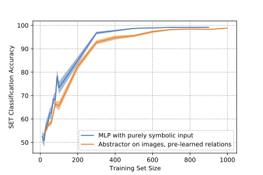

# SET Experiments
In this experiment we compare an Abstractor to a model that uses hand-coded symbolic representation of the relations. The Abstractor is learned end-to-end, including the training of a convolutional neural network to process images of the cards (a standard SET deck has 81 cards).

The Python (Jupyter) notebook `set_symbolic_baseline` is self-contained, and runs all of the steps necessary to build the components of the Abstractor and symbolic model, which are the following: 

1) Train a CNN to label a card with each of its four attributes. This is treated as a multi-label classification problem. The attributes are encoded as 12-vectors of bits, arranged in 4 groups of 1-hot 3-vectors. The CNN has two convolutional layers, each with 32 filters of size $5\times 5$ followed by $4\times 4$ max pooling.

2) Create a dataset of pairs of cards, together with labels indicating the relations between the two cards. This is used to train an Abstractor for the same/different relation for each of the four attributes. The cards are represented as feature maps coming from the CNN. The Abstractors used are coded using the class `SimpleAbstractor` that only uses relational cross attention.

3) Use the projection matrices $W_Q$ and $W_K$ for each of these relations to initialize an Abstractor for the SET classification task. Note that the relations are learned on pairs of cards, but are applied to triples, demonstrating how an Abstractor for one task can be used to solve another. The Abstractor is coded directly as the class `SimpleAbstractorMH`

4) Evaluate learning curves for both the symbolic model, which uses hand-coded relations and a learned MLP, against the Abstractor model which is trained end-to-end on images. The learning curves are plotted and written to disk.

In our installation the notebook generates a plot that looks like this:

